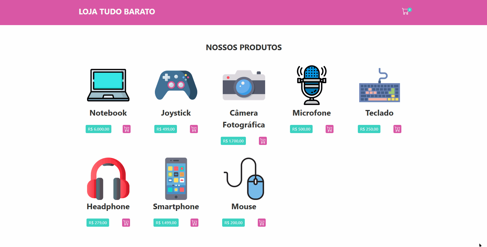

# Shopping-Cart

Uma simples aplicação de carrinho de compras com TypeScript e React, o usuário pode adicionar ou remover produtos no carrinho diretamente da lista de produtos, já no carrinho ele pode, remover, aumentar ou diminuir a quantidade de cada produto, e pode também limpar o carrinho ou confirmar a compra. Nesse projeto utilizei o [JSON Server](https://my-json-server.typicode.com/) para simular que os dados dos produtos estariam vindo de uma API, e utilizei o Local Storage para salvar as informações do carrinho.

